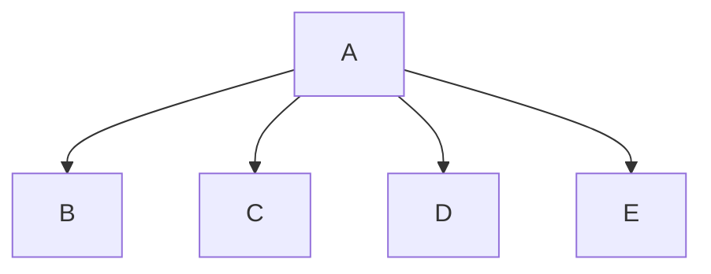

# Program Name
Team member 1, Team member 2, Team member 3

## <program_name> Description
Number_Guessing_Game will generate a random number between 1-1000 unless specified otherwise and will use 2 players and will keep track of the number of turns that each player has used. It will start with a menu that gives 3 options: Guess, Set Range, and Exit. The program will consist of 5 programs: main that will run the program, menu which will display the options and return the choice, return_name which will collect and return the names, random which will generate a random integer that is in a specified minimum and maximum, and guessing that will take turns with guesses and provides feedback on if you are above or below the number.. 

### <program_name> Flowchart

#### Function Diagrams

| `function name1`    |               |  author     |
| ------------------ | ------------- | ------------ |
| `argument:type`    | takes input from the user for ____  |              |
| `time:integer`     | calculates ______  | outputs ____             |
| `name:string`      | takes input for name ___ | returns total |
***
| `function name2`    |               |     author   |
| ------------------ | ------------- | ------------ |
| `argument:type`    | takes input from the user for ____  |              |
| `time:integer`     | calculates ______  | outputs ____             |
| `name:string`      | takes input for name ___ | returns total |
***
