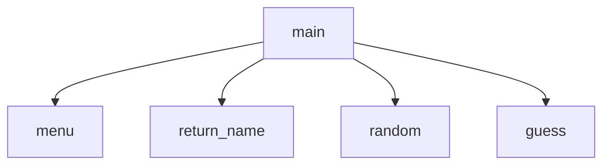

# Number Guessing Game
kiya, jamie

## Number Guessing Game
number_guessing_game() will generate a random number between 1-1000 unless specified otherwise and will use 2 players and will keep track of the number of turns that each player has used. It will start with a menu that gives 3 options: Guess, Set Range, and Exit. The program will consist of 5 programs: main that will run the program, menu which will display the options and return the choice, return_name which will collect and return the names, random which will generate a random integer that is in a specified minimum and maximum, and guessing that will take turns with guesses and provides feedback on if you are above or below the number.. 

#Number Guessing Game
 Flowchart

#### Function Diagrams

| `main()`    |               |  kiya     |
| ------------------ | ------------- | ------------ |
|     | takes input from the user for __nothing__  |              |
|      | calculates _nothing____  | outputs __nothing__             |
|       | takes input for name __nothing_ | returns menu |
***
| `menu()`    |               |     jamie   |
| ------------------ | ------------- | ------------ |
| `argument:none`    | takes input from the user for __menu choice__  |              |
| `time:integer`     | calculates __none____  | outputs choice            |
| `name:string`      | takes input for name _choice__ | returns total |
***
| `return_name()`    |               |     kiya   |
| ------------------ | ------------- | ------------ |
| `player2:string`    | takes input from the user for __name of players__  |              |
| `player1:string`     | calculates ___number of players___  | outputs _nothing___             |
|       | takes input for name _of players__ | returns names |
***
| `random()`    |               |     kiya   |
| ------------------ | ------------- | ------------ |
| `argument:type`    | takes input from the user for min and max number  |              |
| `time:integer`     | calculates a number between min and max  | outputs nothing            |
| `name:string`      | takes input for name return | returns number  |
***
| `guess()`    |               |     jamie   |
| ------------------ | ------------- | ----------- |
| `argument:type`    | takes input from the user for a random number  |              |
| `time:integer`     | calculates how close to number  | outputs outputs if you were less than, greater than, or equal         |
| `name:string`      | takes input for name input for name return | returns how close you were |
